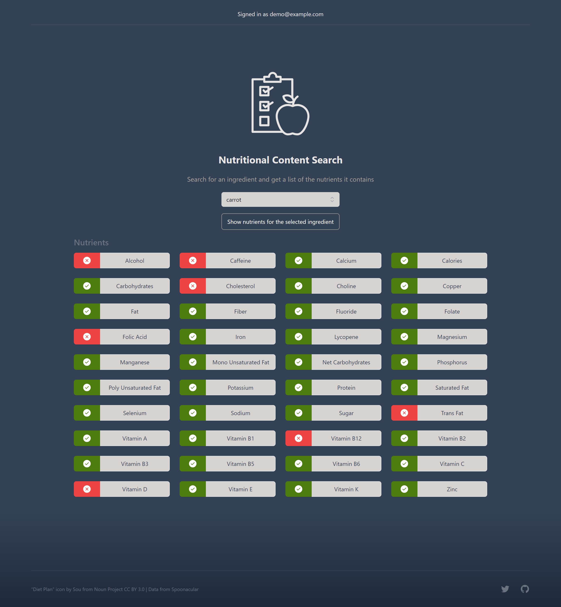

  <a href="https://simple-nutrition.vercel.app/">
    
    <h3 align="center">Simple Nutrition</h3>
  </a>

This is an app that allows for you to check the nutritional makeup of the foods you are consuming.
 
Eventually, you will be able to log foods each day and get an overview of the nutrients you have consumed.

## Screenshot

## Tech Stack

This project uses:

- NextJS 13
- Next Auth
- PostgreSQL
- Prisma
- Tailwind
- Spoonacular's Food api
